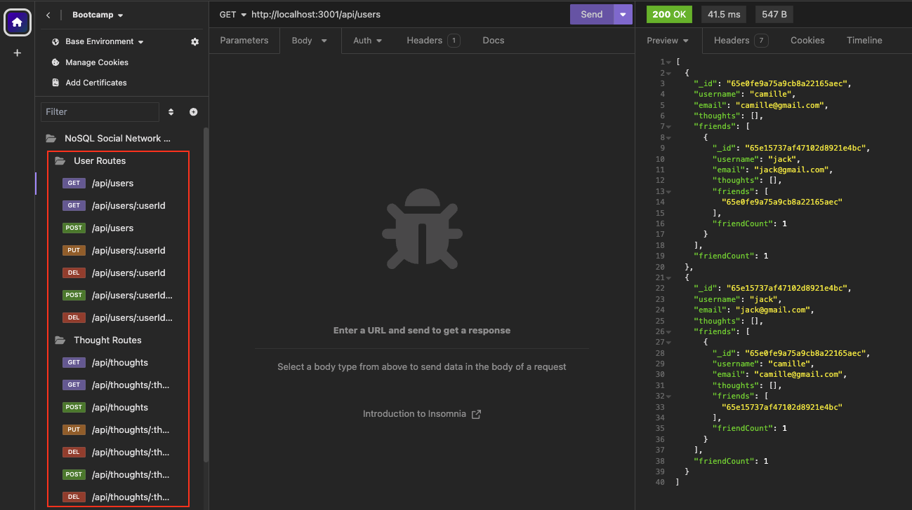

# NoSQL Social Network API

## Description
This project is a back end web application designed to practice using NoSQL. I created a MongoDB database that uses Mongoose for Object Document Mapping (ODM) and Express.js to create RESTful APIs. It replicates a simple social network with the ability to handled unstructured data.

This project taught me:
* The difference between SQL and NoSQL
* How to set up a MongoDB database
* How to create Models using Mongoose methods
* How to use Express.js to create RESTful APIs for back end
* How to write CRUD operations in APIs (Create, Read, Update, Delete)
* How to set up middleware to manage routes
* How to create virtuals in Mongoose
* How to separate controllers, routes and models
* How to use MongoDB operators to manipulate model properties
* and more

Please find the walkthrough video here: https://drive.google.com/file/d/1sp5qS0LBQlwVsQIvh6bQN208yWps6KV6/view?usp=sharing

## Installation
Use npm i to install dependencies below.

Express: https://www.npmjs.com/package/express

Mongoose: https://www.npmjs.com/package/mongoose

## Usage
To test this application, use Insomnia to access different routes of the CRUD operations.

## Credits
MongoDB Documentation: https://www.mongodb.com/docs/

Mongoose Documentation: https://mongoosejs.com/docs/guide.html

## License
n/a